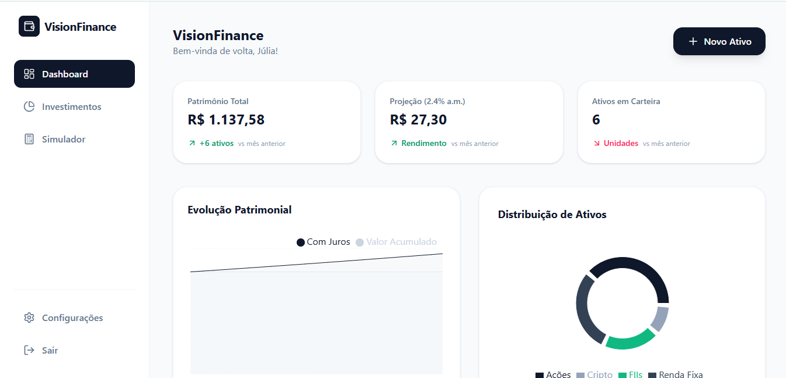

# VisionFinance

O **VisionFinance** é uma plataforma de gestão de investimentos pessoal desenvolvida para oferecer controle total sobre patrimônio, rentabilidade e distribuição de ativos em tempo real.

## Funcionalidades

- **Autenticação Segura**: Sistema de login e cadastro integrado ao Supabase Auth.
- **Gestão de Ativos**: Cadastro, edição e exclusão de investimentos (Ações, FIIs e Renda Fixa).
- **Dashboard Dinâmico**: Visualização de patrimônio total e projeções de rendimento.
- **Gráficos Interativos**: 
  - Distribuição de ativos por categoria.
  - Evolução patrimonial (Valor investido vs. Total acumulado).
- **Segurança de Dados**: Implementação de Row Level Security (RLS) para garantir que cada usuário acesse apenas seus próprios dados.

## Tech Stack

- **Frontend**: [React.js](https://reactjs.org/) + [Vite](https://vitejs.dev/).
- **Estilização**: [Tailwind CSS](https://tailwindcss.com/).
- **Backend/Database**: [Supabase](https://supabase.com/) (PostgreSQL).
- **Ícones**: [Lucide React](https://lucide.dev/).
- **Gráficos**: [Recharts](https://recharts.org/).

## Interface

  

